# Systems Thinking Labs

**A lab for visualizing complex systems, workflows, and ecosystems.**

[](LICENSE)

---

## What Is This?

This is a collection of **Systems Architecture Visualizations** - diagrams designed to compress complexity into understanding. Not documentation for architects, but **cognitive acceleration for stakeholders**.

Inspired by how organizations like the World Economic Forum, McKinsey, and WHO communicate complex systems visually, this lab develops tools and frameworks for:

- Explaining complex workflows to non-technical audiences
- Communicating platform architecture to board members and investors
- Visualizing ecosystem relationships and data flows
- Creating professional-grade diagrams that inspire and inform

> *"The goal is clear, succinct, beautiful visualizations that fast-track understanding and engagement."*

---

## Diagrams

### Platform Ecosystems

#### Concentric Service Model

**Use Cases:** Board presentations, investor pitch, partner alignment, staff onboarding

[](diagrams/concentric-service-model/)

A Platform Ecosystem Diagram showing how the platform wraps community touchpoints around a cyclical engagement engine (CONNECT → ENGAGE → SERVE), with data flowing through an ecosystem network to a central data layer.

[View Details](diagrams/concentric-service-model/) • [Video Export](diagrams/concentric-service-model/systems-architecture-platform-ecosystem-diagram-v5a.mov) • [Generator Code](code/generators/halftone_generator.py)

---

## Search by Use Case

| Use Case | Diagrams |
|----------|----------|
| Nonprofit board presentations | [Concentric Service Model](diagrams/concentric-service-model/) |
| Investor communication | [Concentric Service Model](diagrams/concentric-service-model/) |
| Partner integration | [Concentric Service Model](diagrams/concentric-service-model/) |
| Staff onboarding | [Concentric Service Model](diagrams/concentric-service-model/) |
| Platform architecture | [Concentric Service Model](diagrams/concentric-service-model/) |

---

## The Discipline

This work sits at the intersection of:

| Discipline | Application |
|------------|-------------|
| **Enterprise Architecture** | System boundaries, stakeholder relationships |
| **Information Architecture** | How information flows through layers |
| **Systems Thinking** | Causal loops, feedback cycles, holistic views |
| **Visual Communication Design** | Color, typography, composition for clarity |
| **Stakeholder Psychology** | Cognitive load reduction, fast comprehension |

The formal name: **Systems Architecture Visualization**

The distinguishing factor: *Purpose is cognitive acceleration, not technical documentation.*

---

## Repository Structure

```
systems-thinking-labs/
├── diagrams/                          # All diagram collections
│   └── concentric-service-model/      # Platform ecosystem diagram
│       ├── config.json                # Searchable metadata
│       ├── README.md                  # Diagram documentation
│       ├── *.svg                      # Diagram files
│       ├── *.mov                      # Video exports
│       └── notes.md                   # Design interpretation
├── code/
│   └── generators/                    # Reusable generation scripts
│       └── halftone_generator.py      # Programmatic dot patterns
├── docs/
│   └── principles.md                  # Design philosophy
├── LICENSE
└── README.md                          # This file
```

---

## Design Principles

See [docs/principles.md](docs/principles.md) for the full design philosophy.

**Core tenets:**

1. **Cognitive acceleration** - 10-second understanding, not 10-page documents
2. **Layered abstraction** - Outside-in reveals complexity progressively
3. **Visual metaphor** - Shapes and flows carry meaning
4. **Professional polish** - Matches WEF/McKinsey/Deloitte standards
5. **Reproducibility** - Programmatic generation, version controlled

---

## Tools & Technologies

| Tool | Purpose |
|------|---------|
| **SVG** | Scalable, animatable, embeddable |
| **Python** | Programmatic element generation |
| **CSS Keyframes** | Animation within SVG |
| **Git** | Version control for diagram iterations |

---

## Links

- **Blog:** [Systems Thinking for Stakeholders](https://chrisberno.com/blog/systems-thinking-for-stakeholders)
- **Project:** [Systems Thinking Labs](https://chrisberno.com/projects/systems-thinking-labs)
- **Author:** [Christopher Berno](https://chrisberno.com)

---

## Contributing

This is a personal lab, but ideas and feedback are welcome. Open an issue to discuss.

---

## License

MIT - See [LICENSE](LICENSE)

---

*Built with systems thinking. Designed for humans.*
