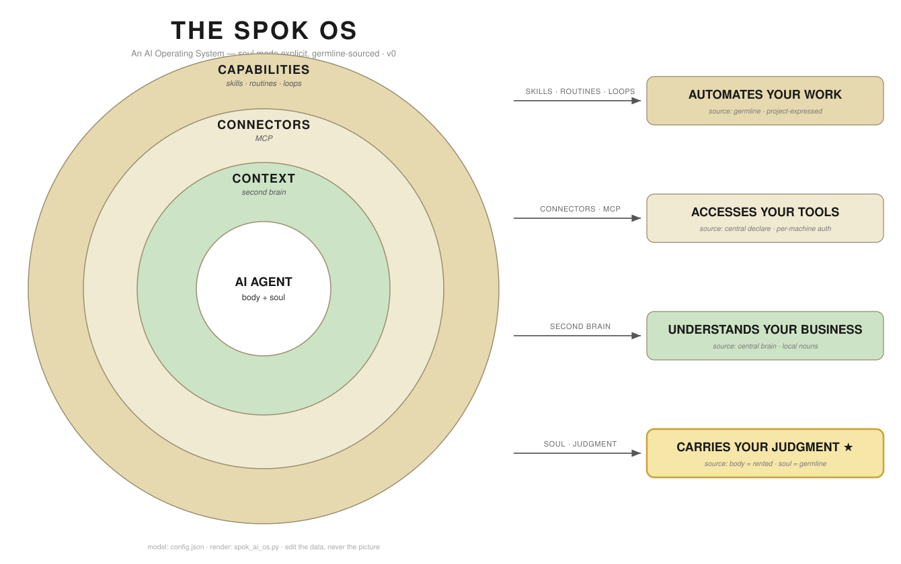

# The SPOK OS

**An AI Operating System — soul made explicit, germline-sourced.**



## Overview

The SPOK-native answer to Ben AI's "THE AI OS" onion. Four concentric rings, each
mapped to an outcome on the right. It says, in one picture, what an AI OS is made of —
**and** two things Ben's slide can't show.

## The Layers (outside-in)

| Ring | Is | Outcome | Source |
|------|----|---------|--------|
| **Capabilities** | skills · routines · loops | automates your work | germline · project-expressed |
| **Connectors** | MCP | accesses your tools | central declare · per-machine auth |
| **Context** | second brain | understands your business | central brain · local nouns |
| **AI Agent** (core) | **body + soul** | **carries your judgment ★** | body = rented · soul = germline |

## What makes it SPOK-native (vs Ben's onion)

1. **Soul is explicit at the core.** The agent is `Body + Soul`, not a single dot. That
   earns the 4th outcome — **"carries your judgment" (★)** — the differentiator. Ben sells
   *understands / accesses / automates*; SPOK adds *acts with your taste*. That ★ is the moat.
2. **Every ring carries a SOURCE tag.** Ben draws the *runtime* onion (what an agent has).
   We overlay the *germline* view (where each ring is pulled from — rented / central / local).
   One picture, both cameras.

## How to read it

- **Inside-out dependency:** capabilities need connectors need context need an agent.
  Build order is inner-first; our current gap is the *outer* ring (skill packaging).
- **Color is the mapping:** each right-side box is the color of its ring. Arrows stay simple.

## Edit / version / grow — the whole point

The **model is `config.json`. The SVG is a disposable projection.** You never hand-edit the
picture. Change the data, regenerate:

```bash
python3 spok_ai_os.py        # reads config.json -> spok-ai-os-<version>.svg
```

To grow it as a team: branch, edit `config.json` (add a ring, change a label, retag a source),
re-run, commit the **data**. Diffs are readable JSON, not SVG noise.

## Files

| File | Purpose |
|------|---------|
| `config.json` | **Source of truth** — metadata + the `rings[]` model |
| `spok_ai_os.py` | Generator — `config.json` → SVG |
| `spok-ai-os-v0.svg` | Current render |

## Roadmap

- **v1:** lift layout constants (`box_x`, radii, colors) into `config.json` so *everything* is
  data; add a `magicui` `<OrbitingCircles>` React render driven by the same `config.json`
  (animated web version for vault/site pages); optional halftone flourish via the shared
  `code/generators/halftone_generator.py`.
- **Graduation:** the canonical model moves into the SPOK germline (`~/SPOK`) when `spok.os`
  packages. This folder is the prototype lab.

## Lineage

Inspired by Ben AI's "THE AI OS" diagram (catalyst video for the broader paradigm).
Anchor ticket: **ONR-107**. Part of the 2026-06-08 "centralize the brain, distribute the
skills" session.
